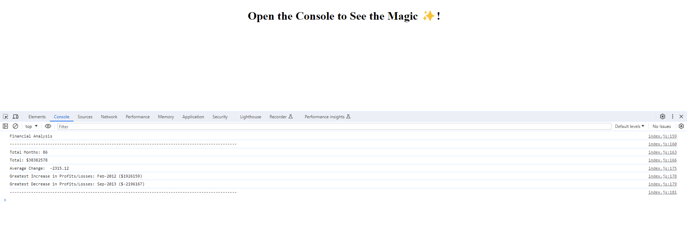

# finances_review

## Description

This webpage demonstrates my ability to use for loops on a dataset and print the various results in the console

## Table of Contents

Included for your ease of use is a table of contents

- [Installation](#installation)
- [Usage](#usage)
- [Credits](#credits)
- [Screenshots](#screenshots)
- [License](#license)

## Installation
  
If you wish to work on the files for this project you can clone it onto your machine and drag the index.html in your browser's url bar to open it using the file protocol.  
  
```Git clone command```  
```
git clone git@github.com:kevinstaresdarbon/finances_review.git
```
  
if you simply wish to view the page you can use this link:  
[Finances_Review](https://kevinstaresdarbon.github.io/finances_review/)

## Usage
  
This webpage is purely for instructional purposes.  It serves no use other than to demonstrate the bare minimum of coding capacity
  
## Credits
  
The starter code at the initial starter commit, HTML and JS file, was provided by the staff of edX.  
All commits after that is original work done by myself.  
No collaboration was needed or taken on this repository and code.  
  
The template and advice for this README was taken from this site:  
<https://coding-boot-camp.github.io/full-stack/github/professional-readme-guide>  
  
## Screenshots  
  
Below are the screenshots of the finished challenge:
  
Above 1200px wide:  
  
 
  
## License  
  
MIT License citation is supplied [HERE](./LICENSE)